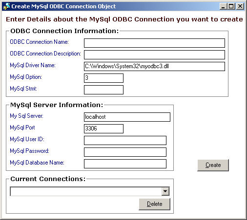



## CreateMySQLODBC

### Description

Allows you to programmatically create an ODBC connection to a MySQL database using the Registry API.
 
### More Info
 

             |
---                |---
**Submitted On**   |2004-04-22 17:11:38
**By**             |[\-\- Val \-\-](https://github.com/Planet-Source-Code/PSCIndex/blob/master/ByAuthor/val.md)
**Level**          |Intermediate
**User Rating**    |5.0 (10 globes from 2 users)
**Compatibility**  |VB 6\.0
**Category**       |[Databases/ Data Access/ DAO/ ADO](https://github.com/Planet-Source-Code/PSCIndex/blob/master/ByCategory/databases-data-access-dao-ado__1-6.md)
**World**          |[Visual Basic](https://github.com/Planet-Source-Code/PSCIndex/blob/master/ByWorld/visual-basic.md)
**Archive File**   |[CreateMySQ1736804232004\.zip](https://github.com/Planet-Source-Code/val-createmysqlodbc__1-53341/archive/master.zip)

